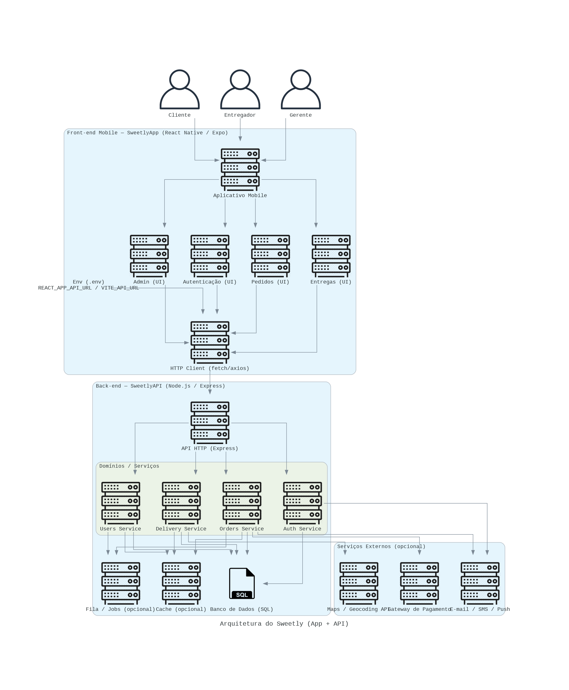

# 🚀 Sweetly

📦 Aplicativo de delivery de doces — disciplina: **Análise e Projeto de Software**

Já pensou em um serviço Delivery especializado em doces? O Sweetly é uma aplicação para quem ama sobremesas: cookies, brigadeiros, açaí, bolos, sorvetes e muito mais.

---

## Índice
- 1) Visão rápida
- 2) Notion / Documentação
- 3) Pré-requisitos
- 4) Como rodar localmente
- 5) Diagrama de arquitetura
- 6) Evidências da Entrega 01 (checklist)
- 7) Testes de sistema
- 8) Programação em par
- 9) Deployment
- 10) Atualizando este README
- 11) Contato

---

## 1) Visão rápida
Sweetly é um MVP de delivery de doces com funcionalidades para clientes, entregadores e gerentes das confeiterias:
- Cadastro e login de usuários
- Criação e acompanhamento de pedidos
- Painel de entregadores para visualizar e aceitar pedidos
- Painel de gerente para gerenciar usuários, pedidos e logs

---

## 2) Notion / Documentação
https://www.notion.so/258918a4b98e80a8bbbde264db92fdfe?v=258918a4b98e8075b38c000cdae19a43&source=copy_link

---

## 3) Pré-requisitos
Antes de começar, instale:
- Node.js 18+ (vem com npm)
- npm ou Yarn
- Git

---

## 4) Como rodar localmente
1. Clone o repositório:
   git clone https://github.com/davialmda/sweetlyapp.git
2. Entre na pasta e instale dependências:
   cd sweetlyapp
   npm install
3. Rodar em modo de desenvolvimento:
   npm run dev
4. Build para produção:
   npm run build
5. Variáveis de ambiente:
   - REACT_APP_API_URL (exemplo)
   - OUTRAS_VARS (exemplo)
(Atualize conforme o projeto)

---

## 5) Diagrama de arquitetura:

---

## 6) Evidências da Entrega 03 — Checklist 
Data da entrega: 21/10

- [✅] Seleção de histórias para implementar (pelo menos 3) — listar aqui as US escolhidas e marcar as implementadas
  - Histórias escolhidas nesta entrega: US01: Cadastro de usuário, US02: Login no sistema, US03: Criar pedido de entrega 
- [✅] Criação de Sprint no Notion 
  - Quadro Notion: <https://www.notion.so/US03-Criar-pedido-de-entrega-258918a4b98e80a78416db40925d06f7?source=copy_link>
  - Sprint: Sprint 01 — início: 29/09 — fim: <07/10>
- [✅] Atualização do diagrama de atividades 
  - Nota: descreva rapidamente as principais mudanças
- [✅] Ambiente de versionamento atuante
  - Evidência: `docs/commits-weekly.png`
- [✅] Deployment das novas histórias — URL pública do deploy + screencast
  - URL do deploy: <INSERIR_URL_DO_DEPLOY>
  - Screencast principal: <INSERIR_URL_DO_VÍDEO>
- [✅] Issue / bug tracker atualizado
- [✅] Testes de Sistema 
  - Relatório: 
  - Screencasts: 
- [✅] Programação em par 
- [✅] Quadro da Sprint 01 atualizado refletindo a entrega 

---

## 7) Testes de sistema (modelo de relatório)

Modelo:
- Teste: Cadastro de Usuário  
  Data: <07/10>  
  Passos:
  1. Abrir página /signup
  2. Preencher nome, email, senha
  3. Submeter formulário
  Resultado: OK  
  Screencast: 

- Teste: Login  
  Data: <07/10>  
  Passos:
   1. Abrir página / login
   2. preencher e-mail e senha;
   3. entrar
  Resultado: OK
  Screencast: 

---

## 9) Programação em par (Pair Programming)

Em ambos foram utilizadas técnicas de programação por pares. (Frontend e Backend)

<>
<>

---

## 10) Deployment
- Plataforma sugerida: 
- URL do deploy: 
- O screencast demonstrando as novas histórias deve mostrar a URL do deploy no vídeo.
- Instruções:
Use este arquivo como referência e mantenha o README apontando para as URLs de deploy (Front-end e API).

---

##  Variáveis de Ambiente

As variáveis abaixo são exemplos. Ajuste os valores conforme o seu projeto.

### 1.1 Front-end (sweetlyapp)
Importante: mantenha consistência com o bundler do projeto.
- Create React App (CRA) usa prefixo REACT_APP_
- Vite usa prefixo VITE_

Recomendado para este projeto (CRA):
- REACT_APP_API_URL: URL pública da API (produção)
- REACT_APP_ENV: ambiente atual (ex.: production, staging)
- REACT_APP_VERSION: versão ou sha do commit (opcional)

Exemplos de arquivos:

Arquivo: .env.local (para desenvolvimento local)
REACT_APP_API_URL=http://localhost:5000
REACT_APP_ENV=development

Arquivo: .env.production (usado no build de produção)
REACT_APP_API_URL=https://sweetlyapi.onrender.com
REACT_APP_ENV=production

Se usar Vite, troque REACT_APP_API_URL por VITE_API_URL em todos os lugares (código e arquivos .env):
VITE_API_URL=...

---

## 11) Como atualizar esse README
1. Adicione/atualize imagens e vídeos em `docs/` conforme a estrutura sugerida.
2. Substitua os placeholders `<INSERIR_...>` por links ou paths reais.
3. Commit e push:
   - git checkout -b feature/docs-sprint01
   - git add README.md docs/
   - git commit -m "docs(sprint01): evidências Entrega 03"
   - git push origin feature/docs-sprint01
4. Abra PR para `main` com checklist preenchido e links para issues/PRs relacionados.

---
